# Olá, eu sou Matheus Henrique 👋

### `Student Developer` | `Future Full Stack Developer`

Sou estudante e desenvolvedor em formação, atualmente focado em **desenvolvimento web**.

Meu objetivo é estudar **Análise e Desenvolvimento de Software no Canadá** e, no futuro, me tornar um **Full Stack Developer**.

---

## Sobre mim

* Estudante e desenvolvedor em formação
* Atualmente aprendendo **JavaScript**
* Conhecimentos em **HTML & CSS**
* Utilizo **VS Code** no desenvolvimento
* Criando projetos para aprender na prática
* Explorando novas tecnologias
* Buscando evoluir constantemente como desenvolvedor
* Futuro estudante de **Análise e Desenvolvimento de Software**
* Objetivo: **Full Stack Developer**

---

## Tech Stack

<p align="left">
  
  
  
  
  
  
</p>

---

## GitHub Stats

<div align="center">



</div>

---

## GitHub Streak

<div align="center">


</div>

---

## Most Used Languages

<div align="center">


</div>

---

## My Journey

```text
2026
│
├── HTML & CSS
├── JavaScript
├── Git & GitHub
└── Personal Projects
        │
        ▼
2027+
│
├── JavaScript Advanced
├── Frameworks
├── Backend
└── Databases
        │
        ▼
Future
│
├── Software Development
├── Canada 🇨🇦
└── Full Stack Developer
```

---

## Projects

Meus projetos estão disponíveis nos meus repositórios.

Cada projeto representa uma oportunidade para **aprender, experimentar e evoluir** como desenvolvedor.

---

## Currently Learning

<p align="center">
  
</p>

---

## Connect with me

<p align="left">

<a href="https://discord.com/">
  
</a>

</p>

---

<div align="center">

### Building. Learning. Improving.

</div>
